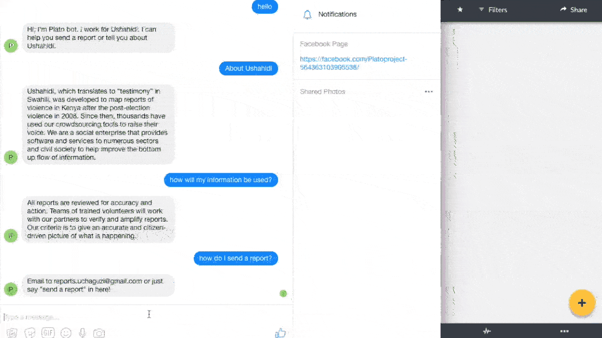

# Plato

Main entry: platobot

The purpose of the chat bot is to automate survey collection for Ushahidi platform, which is a crowdsourced mapping tool.

The server is written in python. It uses Facebook's wit.ai and Dialogflow natural language processing power to understand the user's intention. If the user's intention is to report an event at a location, it would then lock the user in the survey flow that is pre-specified. The report is then send to the corresponding Ushahidi instance.

Demo:
Facebook Messenger:

https://youtu.be/w5LRx9CD8sY

SMS:

https://youtu.be/I8hsDNsQlfc
